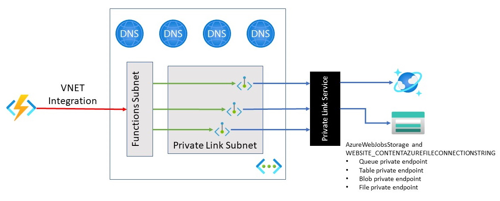

# Secure Azure Functions and Storage example

# Function App with Azure Storage private endpoints


 


This repository contains ```Bicep``` scripts that provisions the following:

- Virtual Network
  - Subnet for private endpoints
  - Subnet for PaaS resources
- Storage account (with private endpoints)
  - Private endpoints for ```blob```, ```queue```, ```file``` and ```table``` sub-resources
- Creates private DNS zones for all 4 four private endpoints listed above (i.e. ```blob```, ```queue```, ```file``` and ```table```)
- Creates a Function app (with EP1 service plan) 
  - Function is VNet integrated for outbound traffics

## How to deploy

You can deploy the consolidated bicep file located into the ```infrastructure``` directory. 

Using Azure CLI:

```
az deployment group create --resource-group 'trojan-resources'  --template-file .\all.bicep
```

## Caveat
It may take 5-10 mins after a successfull deployment when you can deploy code into the function app (as the private endpoint, private DNS configurations are not immediately ready for operation). 


## Resource details


The Bicep template deploys an Azure Function App that communicates with the Azure Storage account referenced by the [AzureWebJobsStorage](https://docs.microsoft.com/azure/azure-functions/functions-app-settings#azurewebjobsstorage) and [WEBSITE_CONTENTAZUREFILECONNECTIONSTRING](https://docs.microsoft.com/azure/azure-functions/functions-app-settings#website_contentazurefileconnectionstring) app settings, [via private endpoints](https://docs.microsoft.com/en-us/azure/azure-functions/functions-networking-options#private-endpoints). 
### Azure Function App

The Function App uses the AzureWebJobsStorage and WEBSITE_CONTENTAZUREFILECONNECTIONSTRING app settings to connect to a private endpoint-secured Storage Account.

### Elastic Premium Plan

The Azure Function app provisioned in this sample uses an [Azure Functions Elastic Premium plan](https://docs.microsoft.com/azure/azure-functions/functions-premium-plan#features). 

### Azure Storage account

The Storage account that the Function uses for operation and for file contents. 


### Virtual Network

Azure resources in this sample either integrate with or are placed within a virtual network. The use of private endpoints keeps network traffic contained with the virtual network.

The sample uses two subnets:

- Subnet for Azure Function virtual network integration.  This subnet is delegated to the Function App.
- Subnet for private endpoints.  Private IP addresses are allocated from this subnet.

### Private Endpoints

[Azure Private Endpoints](https://docs.microsoft.com/azure/private-link/private-endpoint-overview) are used to connect to specific Azure resources using a private IP address  This ensures that network traffic remains within the designated virtual network, and access is available only for specific resources.  This sample configures private endpoints for the following Azure resources:

- [Azure Storage](https://docs.microsoft.com/azure/storage/common/storage-private-endpoints)
  - Azure File storage
  - Azure Blob storage
  - Azure Queue storage
  - Azure Table storage
  
### Private DNS Zones

Using a private endpoint to connect to Azure resources means connecting to a private IP address instead of the public endpoint.  Existing Azure services are configured to use existing DNS to connect to the public endpoint.  The DNS configuration will need to be overridden to connect to the private endpoint.

A private DNS zone will be created for each Azure resource configured with a private endpoint.  A DNS A record is created for each private IP address associated with the private endpoint. 

The following DNS zones are created in this sample:

- privatelink.queue.core.windows.net
- privatelink.blob.core.windows.net
- privatelink.table.core.windows.net
- privatelink.file.core.windows.net

### Application Insights

[Application Insights](https://docs.microsoft.com/azure/azure-monitor/app/app-insights-overview) is used to [monitor the Azure Function](https://docs.microsoft.com/azure/azure-functions/functions-monitoring).